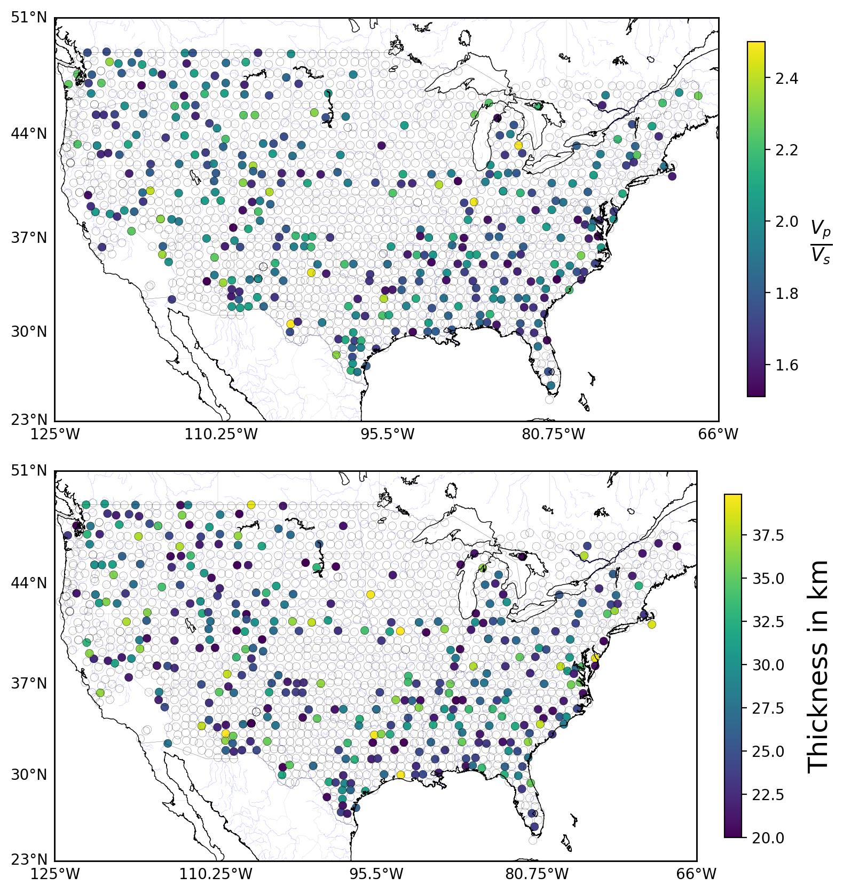
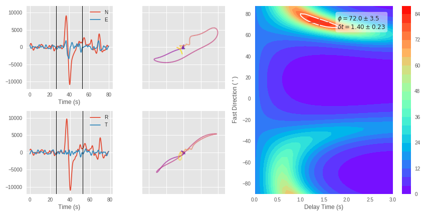
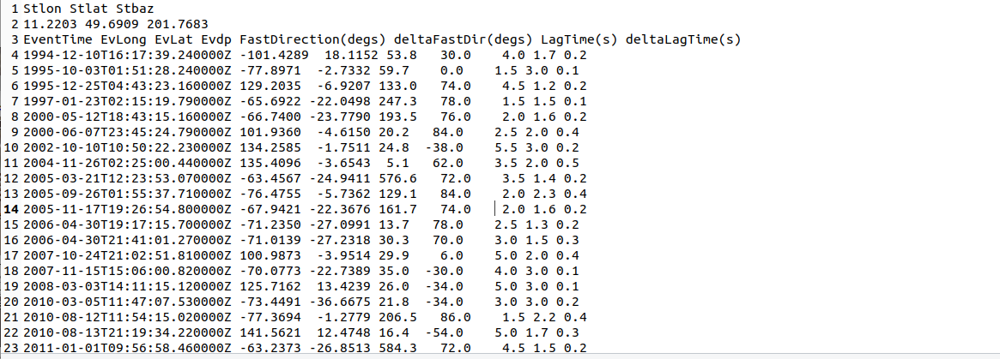
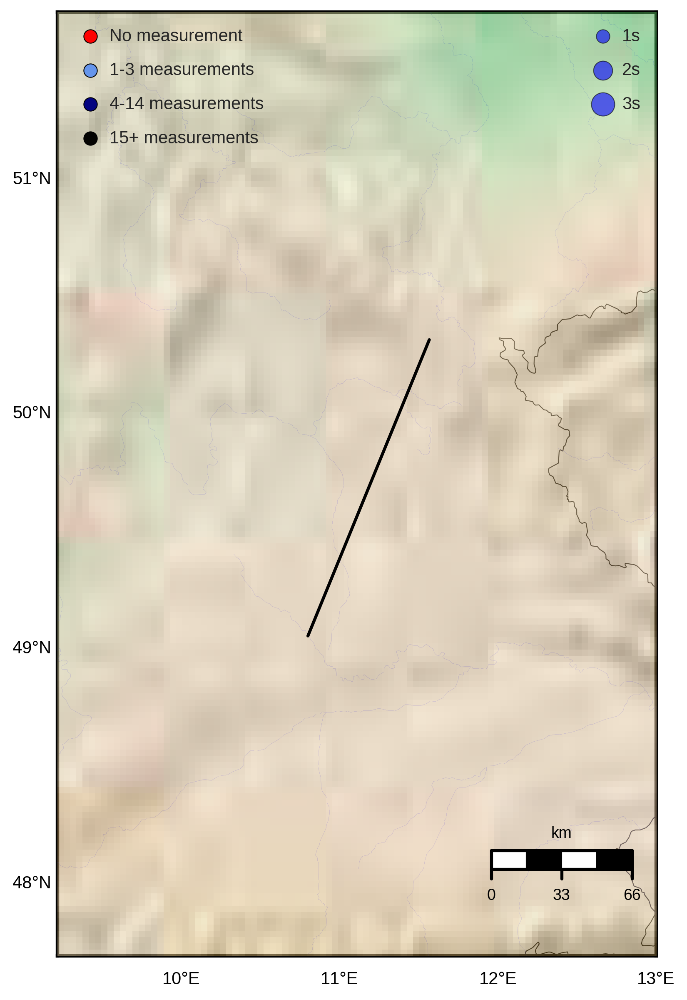

# Receiver Function and SKS automatic measurement - Seismological Tools Automated Download, processing & Imaging Using Mostly Python (STADIUM - Py)
 
<a href="https://doi.org/10.5281/zenodo.4686103"></a>


- By Cédric P Legendre (@cplegendre) and Utpal Kumar (@utpalrai)
- Based on RF analyses by: Tom Eulenfeld (@trichter); https://github.com/trichter/rf
- Based on SKS analyses by: Jack Walpole (@JackWalpole); https://github.com/JackWalpole/splitwavepy
- Based on ObsPy: https://github.com/obspy/

The User's manual for STADIUM-Py can be downloaded from [here](wikiimage/User_Manual_STADIUM-py.pdf).


## Installation
Install the anaconda Python 3 environment `rfsksenv` by running the following command (Note: It requires preinstalled anaconda)


- __OSX:__

```conda env create -f environment_osx_10_14_6.yml```

- __Linux:__

```conda env create -f environment_UbuntuXIX.yml```

- __Windows:__

requires installation of Anaconda Python followed by packages in the environement. 

__To activate the anaconda environement__:

```conda activate rfsksenv```


#### PS: 
- All these libraries can be installed separately in "non-anaconda" environment as well.

- If having some issues with Cartopy, one simple fix may be:

```pip uninstall shapely; pip install --no-binary :all: shapely```
- In __Ubuntu__, there were conflicts in the different required libraries. Therefore, some of the necessary dependencies needed to be installed manually:

  - cartopy
      -- ```conda install -c conda-forge cartopy```
  - h5py
      -- ```conda install h5py```
  - obspyh5
      -- ```pip install obspyh5``` or
      -- ```conda install obspyh5```
  - rf
      -- ```pip install rf```
  - splitwavepy
      -- ```pip install splitwavepy```

## Run:
```python stadium.py```

### User's input:
A total of four files controls the run of STADIUM-Py:
- `input_file.yaml` (select region)
- `Settings/stepwise.yaml` (toggle the steps)
- `Settings/advRFparam.yaml` (fine tune the RF parameters)
- `Settings/advSKSparam.yaml` (fine tune the SKS parameters)

Below, you will find a list of the parameters, with possible values and its description.

### __`input_file`__

- `project\_name`         |default|       Define the name of the project directory where all results will be stored.
- `fresh_start`		| 0/1	|	Delete the 'default' folder and start fresh
- `makeRF`		| 0/1	|	Run the code to calculate the Reciever Functions
- `makeSKS`		|0/1	|	Run the code to calculate the shear-wave splitting of SKS phase

In addition, 4 boundary parameters are used to __select the region of interest__:

1. `mnlong`		|-130	|	Minimum longitude of the region of interest
2. `mxlong`		|-60	|	Maximum longitude of the region of interest
3. `mnlat`			|35	|	Minimum latitude of the region of interest
4. `mxlat`			|50	|	Maximum latitude of the region of interest


### __`stepwise`__

This file is provided in case user want to run specific part of the code (for testing or parameters adjustments).


__data settings__
- `client`		|IRIS	|	Enter all the clients for data download separated by commas. List of ObsPy clients: https://docs.obspy.org/packages/obspy.clients.fdsn.html . Current list -- 24 items: BGR, EMSC, ETH, GEONET, GFZ, ICGC, INGV, IPGP, IRIS, ISC, KNMI, KOERI, LMU, NCEDC, NIEP, NOA, ODC, ORFEUS, RASPISHAKE, RESIF, SCEDC, TEXNET, USGS, USP.
- `network`		|*	|	List of networks (default = all)
- `station`		|*	|	List of stations (default = all)
- `locations`		|"","00"|	List of locations (default = "","00")


__plot settings__
- `plot_stations`		|0/1	|	Create a stations map
- `plot_events`		|0/1	|	Create an events map
- `plot_all_retrieved_events_stations`		|0/1	|	Create a stations and event map


__RF stepwise__
- `obtain_inventory_RF`	| 0/1	|	List all the stations available
- `download_data_RF`	| 0/1	|	Download the waveforms to calculate the Reciever Functions
- `compute_plot_RF`	| 0/1	|	Plot receiver functions?
- `plot_ppoints`		|0/1	|	Plot the piercing points (for Reciever Functions)
- `plot_RF_profile`	|0/1	|	Plot the vertical profiles (for Reciever Functions)


__SKS stepwise__
- `obtain_inventory_SKS`	|0/1	|	List all the stations available (for SKS)
- `download_data_SKS`	|0/1	|	Download the waveforms to calculate the shear-wave splitting of SKS phase
- `plot_traces_ENZ`	|0/1	|	Plot the waveforms (for SKS)
- `plot_traces_RTZ`	|0/1	|	Plot the rotated waveforms (for SKS)
- `plot_SKS_measure`	|0/1	|	Plot the grid search for phase and delay time.
- `plot_SKS`		|0/1	|	Plot the results (for SKS)
- `picking_SKS`		|0/1	|	Picking of the SKS phase
- `plot_traces`		|0/1	|	Plot the traces that may contain SKS phase
- `plot_trigger`		|0/1	|	Plot the automatic picking of the SKS phase


### __`advRFparam.yaml`: RF parameters__

__filenames__
- `invRFfile` 				|rf_stations.xml		|	station xml
- `RFsta`					|all_stations_RF.txt		|	station text catalog
- `retr_stations`				|all_stations_rf_retrieved.txt	|	retrived stations list file
- `data_rf_suffix`			|rf_profile_data		|	rf data file name: {net}-{stn}-rf_profile_data.h5
- `events_map_suffix`			|RF-events_map			|	events map filename suffix {net}-{stn}-RF-events_map.png
- `retr_station_prefix`			|RF_stations			|	retrieved stations prefix
- `rf_compute_data_suffix`		|rf_profile_rfs			|	rf computation result file name: network-station-rf_profile_rfs.h5
- `rfprofile_compute_result_prefix`	|rf_profile_profile		|	rf profile computation result file name: rf_profile_profile{azimuth}_*.h5

__H - K settings__
- `h_kappa_res_file`	|h-kappa-values.txt	|	File name for the H-K results
- `plot_h`		|0/1			|	Plot Moho map
- `plot_kappa`		|0/1			|	Plot Vp/Vs ratio

__RF profile settings__
- `num_profile_divs_lat`	|2	|	Amount of EW profiles
- `num_profile_divs_lon`	|3	|	Amount of NS profiles
- `ppdepth`		|70	|	Chosen depth for piercing point calculation


__RF event search settings__
- `minradiusRF`		|30	|	Minimum epicentral distance (for Reciever Functions)
- `maxradiusRF`		|90	|	Maximum epicentral distance (for Reciever Functions)
- `minmagnitudeRF`	|5.5	|	Minimum magnitudes of events (for Reciever Functions)
- `maxmagnitudeRF`	|9.5	|	Maximum magnitudes of events (for Reciever Functions)

__RF filter settings__
- `minfreq`		|0.5	|	stream minfreq for bandpass
- `maxfreq`		|2.0	|	stream maxfreq for bandpass


__RF display settings__
- `trace_height`		|0.1	|	height of one trace in inches
- `trim_min`		|-5	|	trim stream relative to onset before plotting
- `trim_max`		|20	|	trim stream relative to onset before plotting
- `rf_info`		|default|	additional axes for RF plot, None for no additional axes


### __`advSKSparam`: SKS parameters__ 
__File names__
- `invSKSfile`		|sks_stations.xml		|	station xml
- `SKSsta`		|stations_SKS.txt		|	station text catalog
- `retr_stations`		|all_stations_sks_retrieved.txt	|	retrived stations list file
- `data_sks_suffix`	|sks_profile_data		|	sks data file name: {net}-{stn}-sks_profile_data.h5
- `events_map_suffix`	|SKS-events_map			|	events map filename suffix {net}-{stn}-SKS-events_map.png
- `retr_station_prefix`	|SKS_stations			|	retrieved stations prefix
- `sks_meas_indiv`	|sks_measurements.txt		|	sks measurements file suffix for individual stations
- `sks_measure_map`	|SKS_station_Map		|	filename of sks measurements map

__SKS event search settings__
- `minradiusSKS`		|90  	|	Minimum epicentral distance (for SKS)
- `maxradiusSKS`		|120	|	Minimum epicentral distance (for SKS)
- `minmagnitudeSKS`	|5.5	|	Minimum magnitudes of events (for SKS)
- `maxmagnitudeSKS`	|9.5	|	Maximum magnitudes of events (for SKS)


__SKS filter settings__
- `minfreq`		|0.01	|	stream minfreq for bandpass
- `maxfreq`		|0.6	|	stream maxfreq for bandpass


__SKS picking__
- `trimstart`		|30	|	trim the traces for sks picking trace starttime+trimstart  to starttime+trimend
- `trimend`		|110	|	trim the traces for sks picking trace starttime+trimstart  to starttime+trimend

__SKS picking algorithm__
- `sks_picking_algo`	|recursive_sta_lta	|	picking algorithm for sks phase...other options are classic_sta_lta, z_detect, carl_sta_trig, delayed_sta_lta
- `sks_picking_algo_thr0`	|2.5			|	starting threshold for sks picking algorithm
- `sks_picking_algo_thr1`	|0.65			|	end threshold for sks picking algorithm

__SKS measurements constraints__

 - `sel_param`: lam12 #options: snr, lam12; selection parameter of the measurements: either use signal to noise ratio, snr or use the eigenvalue ratio (lambda1/lambda2), lam12

##### sel_param_settings:
 - `snr_ratio`		|2	|	minimum signal to noise ratio of the traces for filtering good measurements
 - `lam12fast_threh`	|1.1	|	threshold for the lambda1/lambda2 for fast direction pick
 - `lam12lag_threh`	|1.1	|	threshold for the lambda1/lambda2 for lag time pick
##### lag_settings:
 - `minlag`		|0	|	minimum allowed lag time in sks measurements
 - `maxlag`		|3	|	maximum allowed lag time in sks measurements
 - `maxdlag`		|1.5	|	maximum allowed error in the lag time
##### fast_dir_settings:
 - `maxdfast`		|7	|	maximum allowed error in the fast direction

__error_plot_toggles__:
 - `error_plot_indiv`	|0	|	make 1 to plot the error profiles of fast direction and lag time for each measurements
 - `error_plot_all`	|1	|	make 1 to plot the error profiles of fast direction and lag time for each measurements


__PS__:
These parameters should be modified with caution by the users.

### __Procedure__:

- Search the events that satisfy some critera (defined input_file.yaml).

- Search all stations for which data are available (defined input_file.yaml).

- Download the waveforms.

- This is an automated procedure that may be time consuming if a large dataset is selected.


## Process the data following:

### RF
- Filter and rotate the trace into the LQ domain.
- Deconvolve the radial and tangential components by the vertical component.
- Calculate the piercing points for each event.
- Stacks the reciever functions before plotting.
- Plot the reciever functions for L and Q components, sorted by back azimuth (or distance).
- Create some vertical profile for all stations in selected regions.

### SKS
- Filter and rotate the trace into the radial/tangential referencial.
- Minimize the energy on the transverse components.
- Automatically pick the SKS phase.
- Invert for phase and delay time.
- Plot the results.


## Display parameters:

### Station Map


### Events Map

#### For RF:


#### For SKS:


#### Reciever Functions

 * Single event RF


 * Piercing points


 * Single station profile


#### Reciever Functions - Multiple station profile


#### Reciever Functions - H - Kappa measurements on individual RF


#### Reciever Functions - H - Kappa maps




### SKS
 * Read the station HDF5 file containing all the seismic traces recovered for this station.


 * Filter and rotate the trace into the radial / tangential referencial.
            ```trace1.rotate('NE->RT')```


 * Minimize the energy on the transverse components.

 * Automatically pick the SKS phase.
We implemented several picking options from [ObsPy](https://github.com/obspy/obspy/wiki) to attempt to pick the SKS phase.


 * Invert for phase and delay time.
                ```measure = sw.EigenM(data)```




 * Get all the potential SKS measurements for each station




 * Plot the results.
 <p align="left">



 </p>

## Cite as
Kumar, Utpal, & Legendre, Cédric P. (2021, January 16). STADIUM-Py: Python Command-line Interface for automated Receiver Functions and Shear-Wave Splitting Measurements (Version 1.0). Zenodo. http://doi.org/10.5281/zenodo.4686103
