# Receiver Function and SKS automatic measurement - Seismological Tools Automated Download, processing & Imaging Using Mostly Python (STADIUM - Py)
- By Cédric P Legendre (@cplegendre) and Utpal Kumar (@utpalrai)
- Based on RF analyses by: Tom Eulenfeld (@trichter); https://github.com/trichter/rf
- Based on SKS analyses by: Jack Walpole (@JackWalpole); https://github.com/JackWalpole/splitwavepy
- Based on ObsPy: https://github.com/obspy/


## Installation
#Install the environment `rfsksenv` by running the following command (Note: It requires preinstalled anaconda)


#### For OSX:
```conda env create -f environment_osx_10_14_6.yml```

#### For Linux:
```conda env create -f environment_UbuntuXIX.yml```

#### Then:
```conda activate rfsksenv```

#### If having some issues with Cartopy, one simple fix may be:
```pip uninstall shapely; pip install --no-binary :all: shapely```

#### With some UBUNTU distributions, it was impossible to call pip from conda. Therefore, some of the necessary dependencies were not installed and needed to be installed manually:
    - cartopy
        -- ```conda install -c conda-forge cartopy```
    - h5py
        -- ```conda install h5py```
    - obspyh5
        -- ```pip install obspyh5``` or
        -- ```conda install obspyh5```
    - rf
        -- ```pip install rf```
    - splitwavepy
        -- ```pip install splitwavepy```

## Run:
```python main.py```

### User's input:
Most of the code is automated. However, several parameters need to be set by the user.
Those are defined in "input_parameters.txt".
Below, you will find a list of the parameters, with possible values and description.

### Basic parameters
- fresh_start		| 0/1	|	Delete the 'results' folder and start fresh
- client		|IRIS	|	Enter all the clients for data download separated by commas. List of ObsPy clients: https://docs.obspy.org/packages/obspy.clients.fdsn.html

### Station selection
- mnlong		|-130	|	Minimum longitude of the region of interest
- mxlong		|-60	|	Maximum longitude of the region of interest
- mnlat			|35	|	Minimum latitude of the region of interest
- mxlat			|50	|	Maximum latitude of the region of interest
- network		|*	|	List of networks (default = all)
- station		|*	|	List of stations (default = all)

### RF parameters
- makeRF		| 0/1	|	Run the code to calculate the Reciever Functions
- obtain_inventory	| 0/1	|	List all the stations available
- download_data_RF	| 0/1	|	Download the waveforms to calculate the Reciever Functions
- minradiusRF		|30	|	Minimum epicentral distance (for Reciever Functions)
- maxradiusRF		|90	|	Maximum epicentral distance (for Reciever Functions)
- minmagnitudeRF	|5.5	|	Minimum magnitudes of events (for Reciever Functions)
- maxmagnitudeRF	|9.5	|	Maximum magnitudes of events (for Reciever Functions)
- plot_stations		|0/1	|	Create a stations map (for Reciever Functions)
- plot_events		|0/1	|	Create an events map (for Reciever Functions)
- plot_RF		|0/1	|	Plot the results (for Reciever Functions)
- plot_ppoints		|0/1	|	Plot the piercing points (for Reciever Functions)
- num_profile_divs	|1	|	Amount of vertical and horizontal profiles
- plot_RF_profile	|0/1	|	Plot the vertical profiles (for Reciever Functions)

### SKS parameters
- makeSKS		|0/1	|	Run the code to calculate the shear-wave splitting of SKS phase
- obtain_inventory_SKS	|0/1	|	List all the stations available (for SKS)
- download_data_SKS	|0/1	|	Download the waveforms to calculate the shear-wave splitting of SKS phase
- minradiusSKS		|90  	|	Minimum epicentral distance (for SKS)
- maxradiusSKS		|120	|	Minimum epicentral distance (for SKS)
- minmagnitudeSKS	|5.5	|	Minimum magnitudes of events (for SKS)
- maxmagnitudeSKS	|9.5	|	Maximum magnitudes of events (for SKS)
- plot_SKS_stations	|0/1	|	Create a stations map (for SKS)
- plot_SKS_events	|0/1	|	Create an events map (for SKS)
- plot_SKS		|0/1	|	Plot the results (for SKS)
- picking_SKS		|0/1	|	Picking of the SKS phase
- plot_traces_ENZ	|0/1	|	Plot the waveforms (for SKS)
- plot_traces_RTZ	|0/1	|	Plot the rotated waveforms (for SKS)
- plot_trigger		|0/1	|	Plot the automatic picking of the SKS phase
- plot_SKS_measure	|0/1	|	Plot the grid search for phase and delay time.

The other parameters are defined in the code and should be modified with caution by the users.

### Procedure:

#### Search the events that satisfy some critera (defined input_parameters.txt).

#### Search all stations for which data are available (defined input_parameters.txt).

#### Download the waveforms.

#### This is an automated procedure that may be time consuming if a large dataset is selected.


## Process the data following:

### RF
- Filter and rotate the trace into the LQ domain.
- Deconvolve the radial and tangential components by the vertical component.
- Calculate the piercing points for each event.
- Stacks the reciever functions before plotting.
- Plot the reciever functions for L and Q components, sorted by back azimuth (or distance).
- Create some vertical profile for all stations in selected regions.

### SKS
- Filter and rotate the trace into the radial/tangential referencial.
- Minimize the energy on the transverse components.
- Automatically pick the SKS phase.
- Invert for phase and delay time.
- Plot the results.


## Display parameters:

### Station Map

<p align="center">
  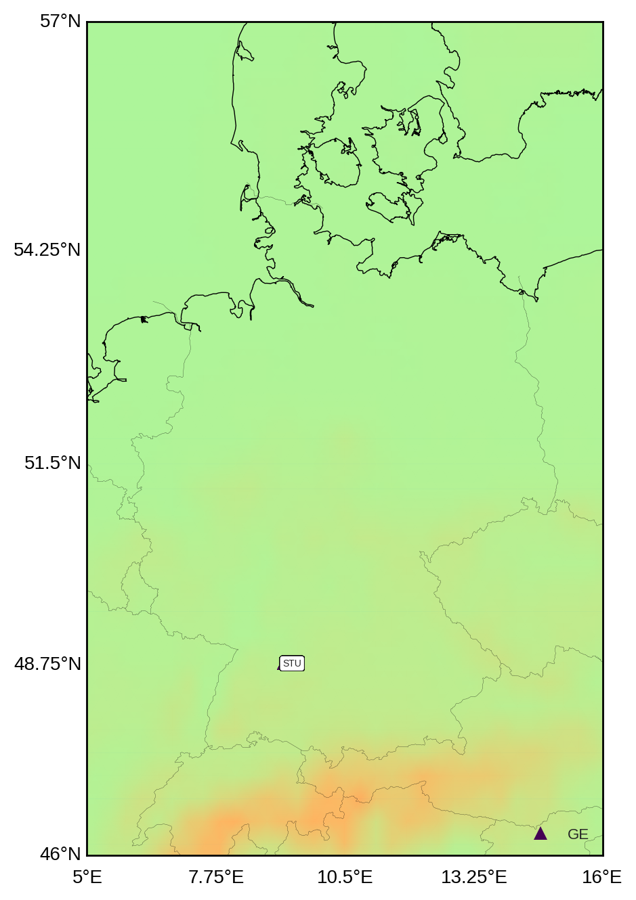
</p>

### Events Map

#### For RF:

<p align="center">
  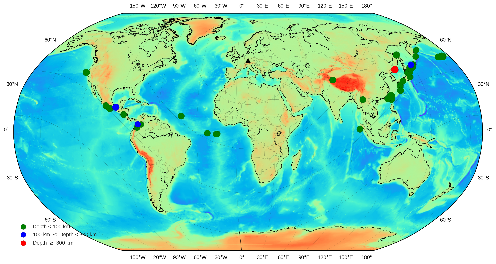
</p>

#### For SKS:
<p align="center">
  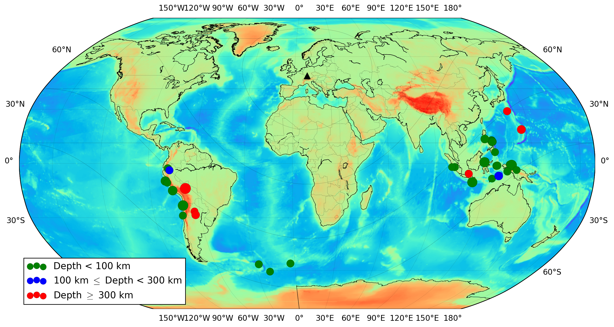
</p>

#### Reciever Functions

 * Single event RF

<p align="center">
  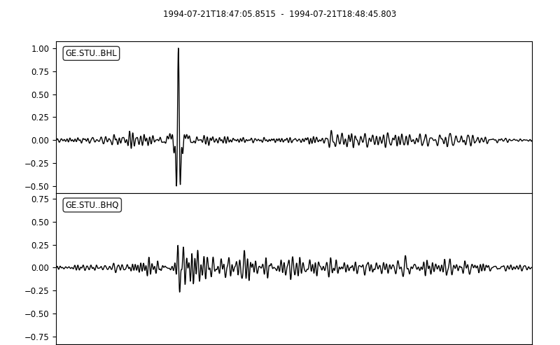
</p>

 * Piercing points

<p align="center">
  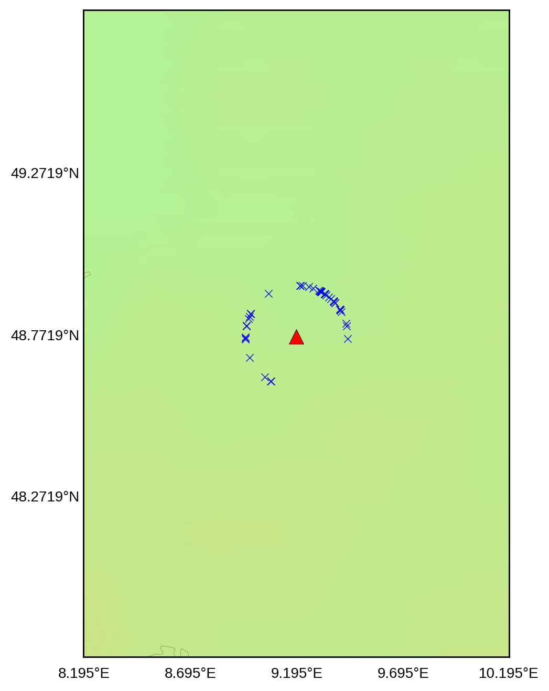
</p>


 * Single station profile

<p align="center">
  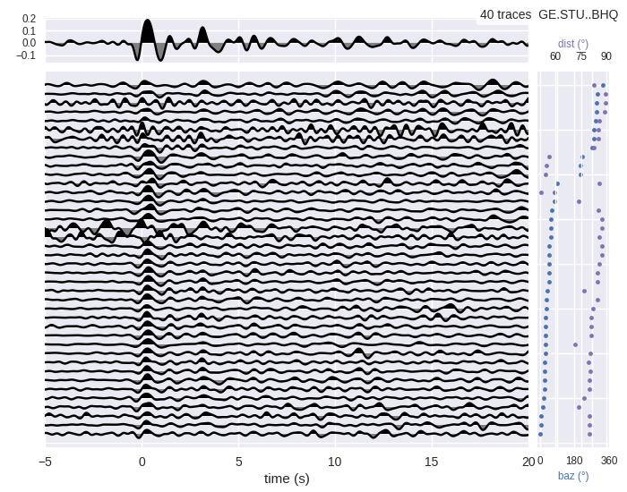
</p>

<p align="center">
  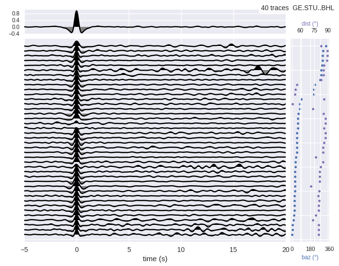
</p>

#### Reciever Functions - Multiple station profile

<p align="center">
  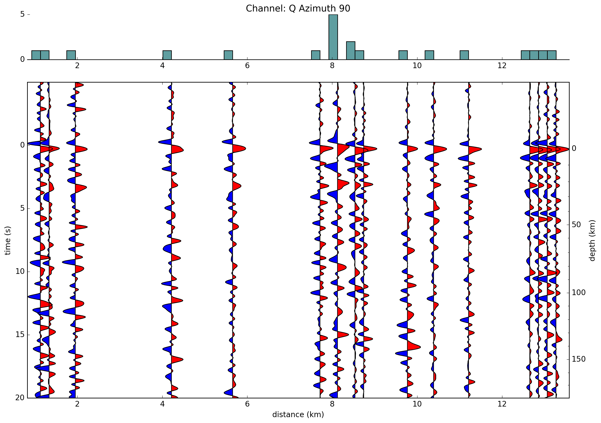
</p>


### SKS
 * Read the station HDF5 file containing all the seismic traces recovered for this station.

<p align="center">
  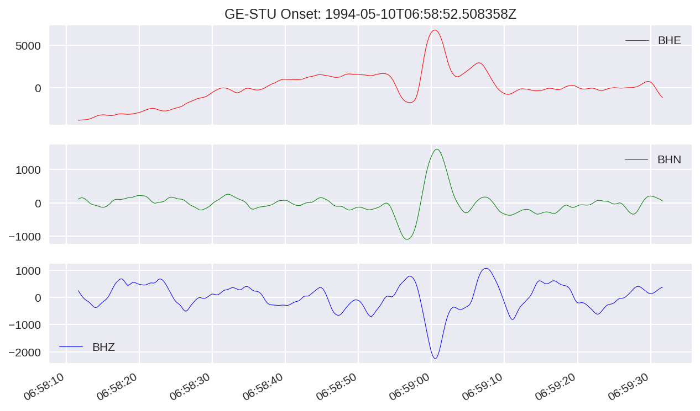
</p>

 * Filter and rotate the trace into the radial / tangential referencial.
            ```trace1.rotate('NE->RT')```
<p align="center">
  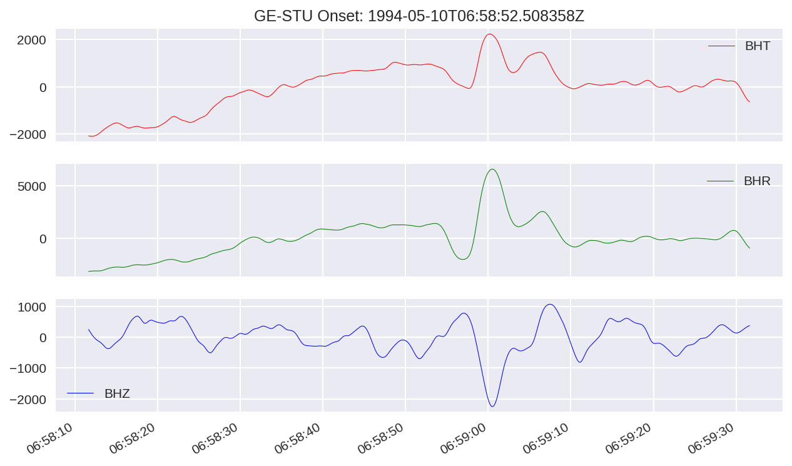
</p>
 * Minimize the energy on the transverse components.
 * Automatically pick the SKS phase.
We implemented several picking options from [ObsPy](https://github.com/obspy/obspy/wiki) to attempt to pick the SKS phase.
<p align="center">
  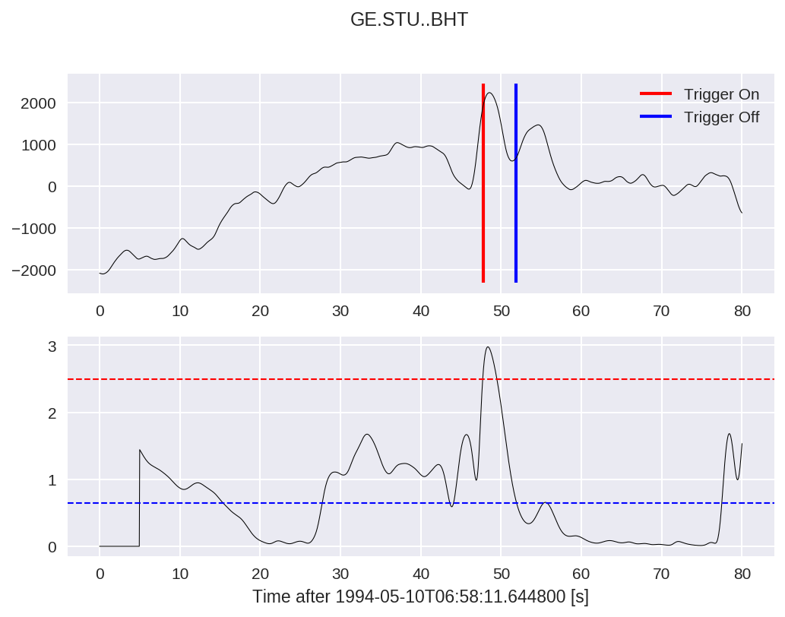
</p>
 * Invert for phase and delay time.
                ```measure = sw.EigenM(data)```
 * Plot the results.
